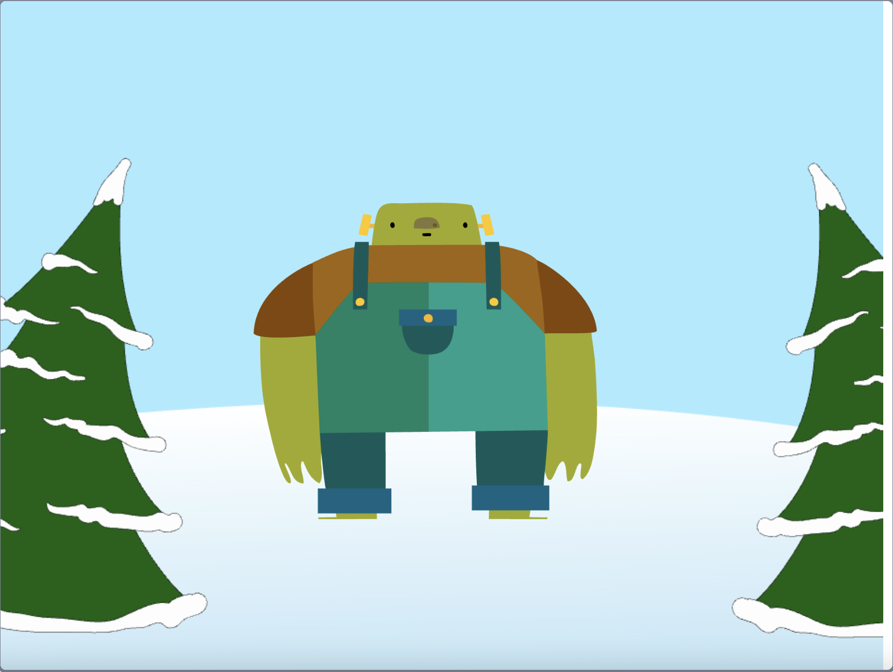

Chcete-li svůj projekt spustit v režimu celé obrazovky ve Scratch, přejděte do oblasti nad vymezenou plochou a klikněte na ikonu se čtyřmi šipkami směřujícími ven. Toto je ikona **Ovládání celé obrazovky**:

Chcete-li ukončit režim celé obrazovky, klikněte znovu na ikonu **Ovládání celé obrazovky**. Bude mít čtyři šipky směřující dovnitř.
