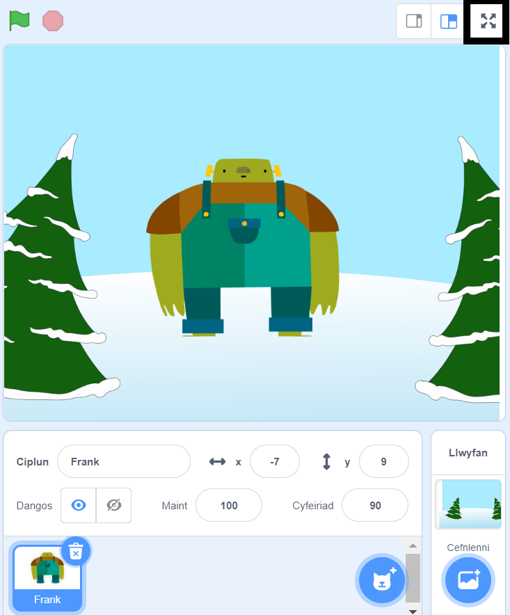

I redeg dy brosiect yn y modd sgrin lawn yn Scratch, cer i'r ardal uwchben y Llwyfan a chlicio ar yr eicon gyda phedwar saeth sy'n pwyntio am allan. Dyma'r eicon **Rheoli Sgrin Lawn**:

I adael y modd sgrin lawn, clicia ar yr eicon **Rheoli Sgrin Lawn** eto. Bydd ganddi bedair saeth sy'n pwyntio am i mewn.
