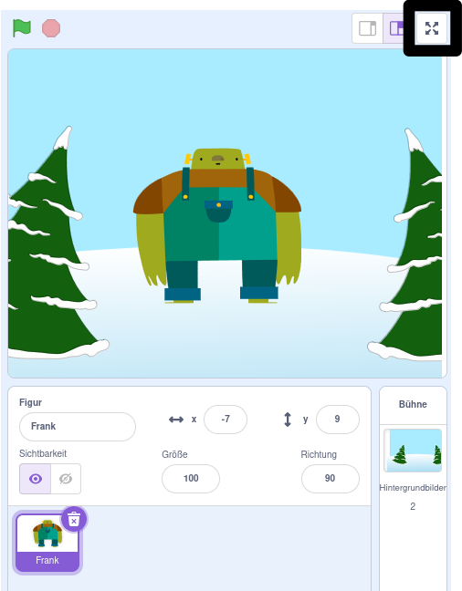

Um dein Scratch-Projekt im Vollbildmodus auszuführen, gehe in den Bereich über der Bühne und klicke auf das Symbol mit den vier nach außen gerichteten Pfeilen. Dies ist das Symbol **Vollbildsteuerung**:

Um den Vollbildmodus zu verlassen, klicke erneut auf das Symbol **Vollbildsteuerung**. Es hat vier Pfeile, die nach innen zeigen.
