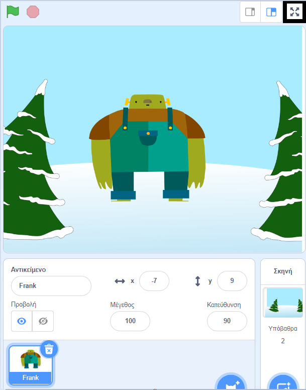

Για να τρέξεις το έργο σου σε λειτουργία πλήρους οθόνης στο Scratch, πήγαινε στην περιοχή πάνω από τη Σκηνή και κάνε κλικ στο εικονίδιο με τέσσερα βέλη που δείχνουν προς τα έξω. Αυτό είναι το εικονίδιο **Ελέγχου Πλήρους Οθόνης**:

Για να φύγεις από τη λειτουργία πλήρους οθόνης, κάνε ξανά κλικ στο εικονίδιο **Ελέγχου Πλήρους Οθόνης**. Θα έχει τέσσερα βέλη που δείχνουν προς τα μέσα.
