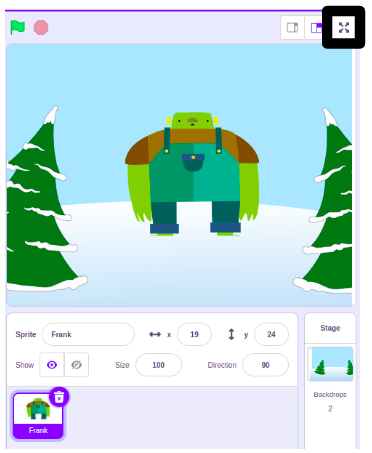

To run your project in full-screen mode in Scratch, go to the area above the Stage and click the button with four arrows that point outwards. This is the **Full Screen Control** icon.

To go back to the regular view, click on the **Full Screen Control** icon again. It will have four arrows that point inwards.
