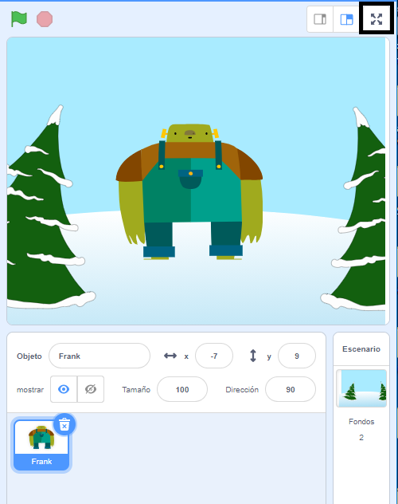

Para ejecutar tu proyecto en modo de pantalla completa en Scratch, ve al área sobre el escenario y haz clic en el ícono con cuatro flechas que apuntan hacia afuera. Este es el ícono **Control de pantalla completa**:

Para volver a la vista normal, vuelve a hacer clic en el ícono **Control de pantalla completa**. Tendrá cuatro flechas que apuntan hacia adentro.
