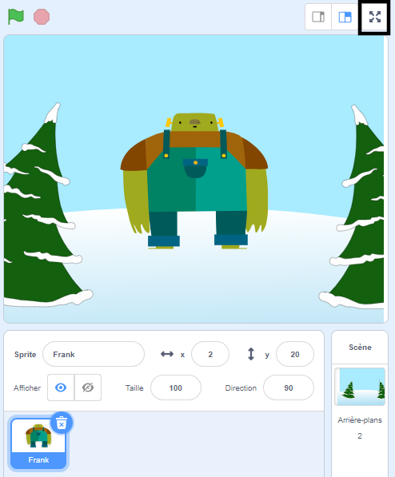

To run your project in full-screen mode in Scratch, go to the area above the Stage and click on the icon with four arrows that point outwards. This is the **Full Screen Control** icon:

To exit full-screen mode, click on the **Full Screen Control** icon again. Il aura quatre flèches qui pointent vers l'intérieur.
