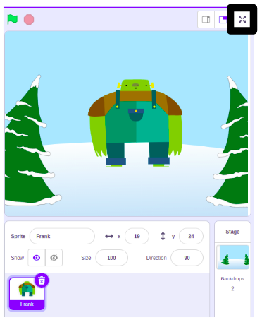

स्टेज के ऊपर के क्षेत्र में बाहर की ओर संकेत करने वाले चार तीरों वाले बटन पर क्लिक करके आप Scratch में अपने प्रोजेक्ट को फ़ुल-स्क्रीन मोड में Run कर सकते हैं । यह **Full Screen Control** आइकन है:

**Full Screen Control** आइकन पर फिर से क्लिक करके फ़ुल-स्क्रीन मोड से बाहर आ सकते हैं । इसमें चार तीर होंगे जो अंदर की तरफ़ इशारा करते हैं।
