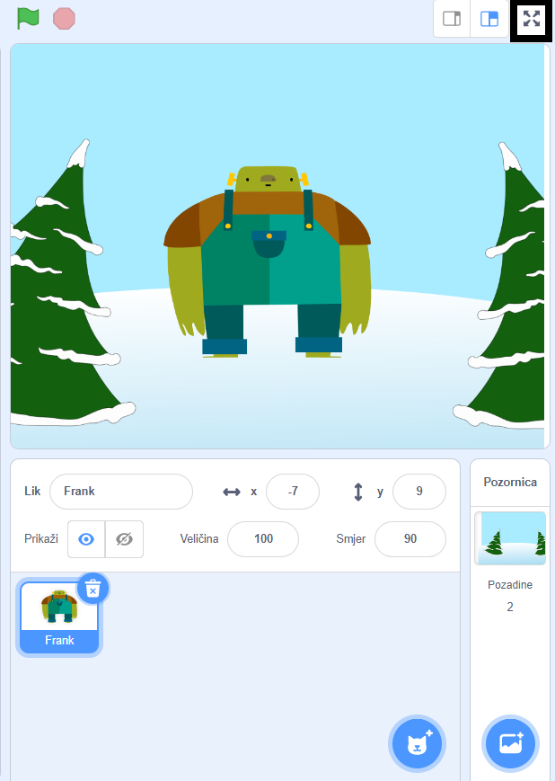

Da pokreneš svoj projekt preko cijelog zaslona u Scratchu, idi do područja iznad pozornice i klikni na ikonu s četiri strelice koje pokazuju prema van. Ovo je ikona **Kontrola cijelog zaslona**:

Da izađeš iz načina rada preko cijelog zaslona, ​​ponovno klikni na ikonu **Kontrola cijelog zaslona**. Imati će četiri strelice koje pokazuju prema unutra.
