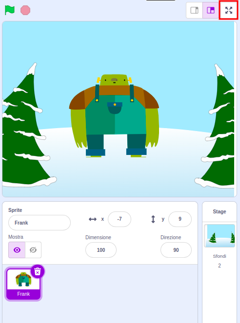

Per eseguire il tuo progetto in modalità a schermo intero in Scratch, vai nell'area sopra lo Stage e clicca sull'icona con quattro frecce rivolte verso l'esterno. Questa è l'icona **Pulsante modalità a tutto schermo**:

Per uscire dalla modalità a schermo intero, fai nuovamente clic sull'icona **Pulsante modalità a tutto schermo**. Avrà quattro frecce che puntano verso l'interno.
