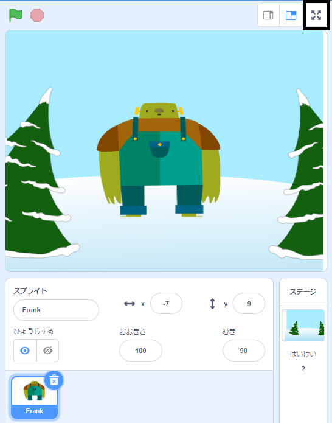

To run your project in full-screen mode in Scratch, go to the area above the Stage and click on the icon with four arrows that point outwards. これが **フルスクリーンコントロール** アイコンです:

To exit full-screen mode, click on the **Full Screen Control** icon again. この時は「4本の矢印が内側に向いてる」ボタンになります。
