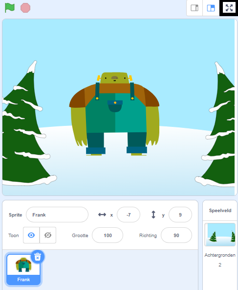

To run your project in full-screen mode in Scratch, go to the area above the Stage and click on the icon with four arrows that point outwards. Dit is het pictogram **Volledig scherm besturing**.

To exit full-screen mode, click on the **Full Screen Control** icon again. Het heeft vier pijlen die naar binnen wijzen.
