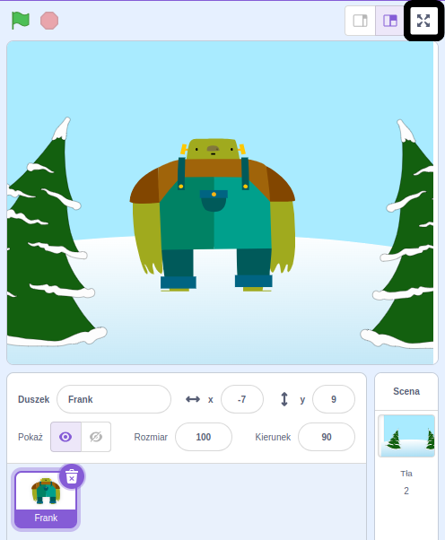

Aby uruchomić projekt w trybie pełnoekranowym w programie Scratch, przejdź do obszaru nad sceną i kliknij ikonę z czterema strzałkami skierowanymi na zewnątrz. To jest ikona **Pełny ekran**:

Aby wyjść z trybu pełnoekranowego, kliknij ponownie ikonę **Pełny ekran**. Będzie miała cztery strzałki skierowane do wewnątrz.
