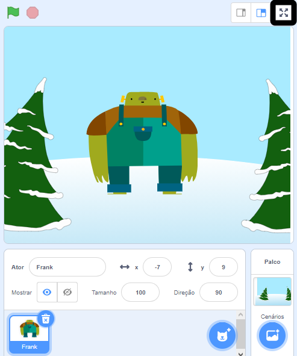

To run your project in full-screen mode in Scratch, go to the area above the Stage and click on the icon with four arrows that point outwards. Este é o ícone **Controle de tela cheia**:

To exit full-screen mode, click on the **Full Screen Control** icon again. It will have four arrows that point inwards.
