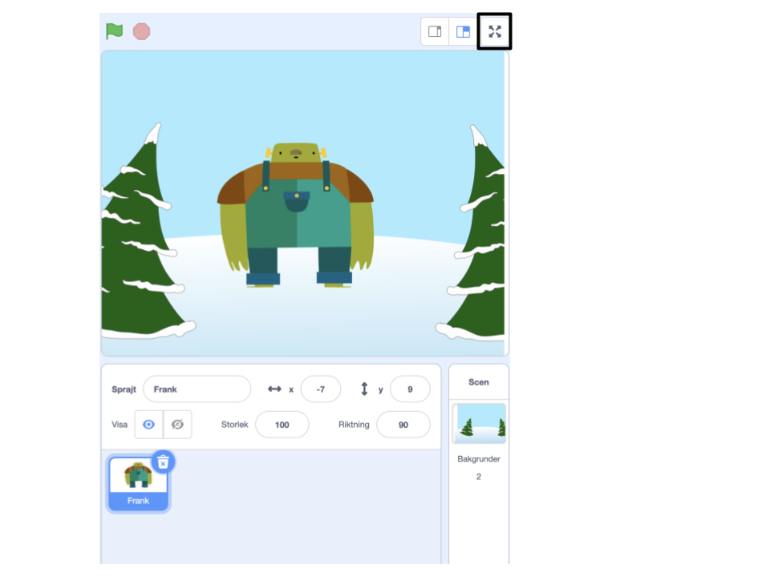

För att köra ditt projekt i helskärmsläge i Scratch, gå till området ovanför scenen och klicka på ikonen med fyra pilar som pekar utåt. Detta är ikonen **Helskärmskontroll**:

För att lämna helskärmsläget klickar du på **Helskärmskontroll**ikonen igen. Den kommer att ha fyra pilar som pekar inåt.
