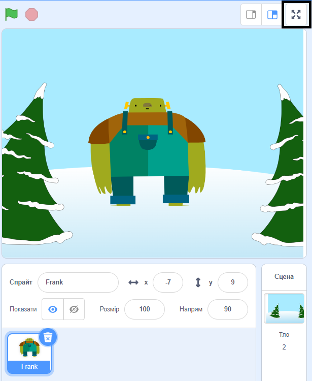

Щоб запустити проєкт у повноекранному режимі в Scratch, перейди в область над Сценою і натисни на іконку з чотирма стрілками, які спрямовані назовні. Це іконка **Повноекранний режим**:

Для виходу з повноекранного режиму натисни на іконку **Повноекранний режим** ще раз. Вона матиме чотири стрілки, які спрямовані назовні.
