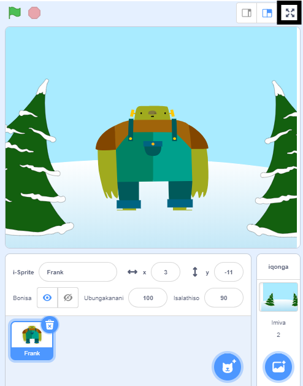

Ukuze iprojekthi yakho igcwalise iskrini xa uyidlalayo kuScratch, yiya kwindawo engasentla kweQonga kwaye ucofe uphawu olunentolo ezine ezikhomba ngaphandle. Olu luphawu loku **Lawula ukugcwaliswa kweskrini**:

Ukuphuma kwimo yesikrini esigcweleyo, cofa kwuphawu loku **Lawula ukugcwaliswa kweskrini** kwakhona. Iza kuba neentolo ezine ezikhomba ngaphakathi.
